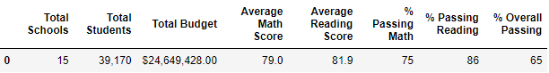
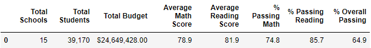
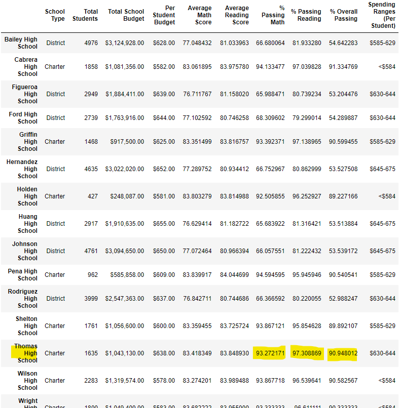
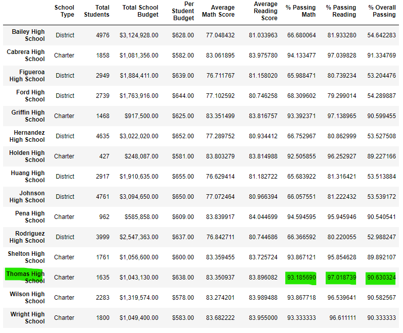
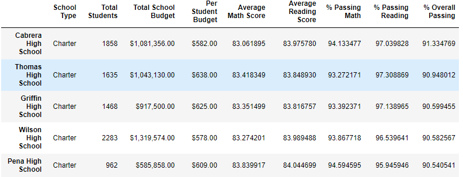
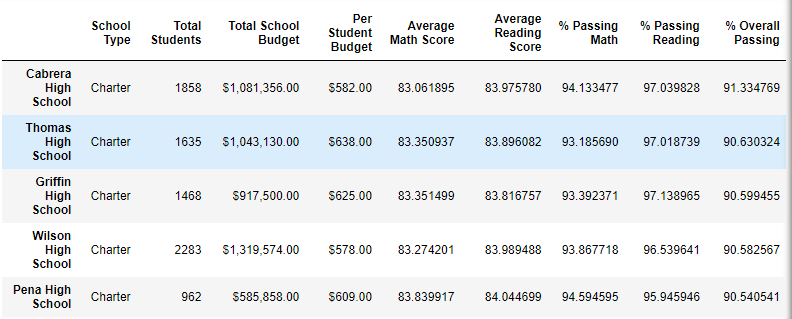

# School District Analysis

## Overview
The school board has notified Maria and her supervisor that the 
<code>students_complete.csv</code> file shows evidence of academic 
dishonesty; specifically, reading and math grades for Thomas High 
School ninth graders appear to have been altered. Although the school 
board does not know the full extent of the academic dishonesty, 
they want to uphold state-testing standards and have turned to Maria 
for help. She has asked you to replace the math and reading scores 
for Thomas High School with NaNs while keeping the rest of the data 
intact. Once you’ve replaced the math and reading scores, Maria would 
like you to repeat the school district analysis that you did in this 
module and write up a report to describe how these changes affected 
the overall analysis.

## Results
Using bulleted lists and images of DataFrames as support, 
address the following questions.

### How is the district summary affected?

There was a change in Average Math Score, % Passing Math, %Passing
Reading and % Overall Passing decreased between 0.1% and 0.3%. 
As shown in the following figures.

*District Summary before replacement*

*District Summary after replacement*

### How is the school summary affected?

This change only affected the Thomas High School data, the other data
remained intact, this was the purpose of the analysis.

*School Summary before replacement*

*School Summary after replacement*

### How does replacing the ninth graders’ math and reading scores affect Thomas High School’s performance relative to the other schools?

Replacing ninth graders’ math and reading scores affect 
Thomas High School’s performance relative to the other schools 
does not affect their % Overall Passing.  Thomas High School is still
second highest.

*High Performing Schools before replacement*

*High Performing Schools after replacement*

### How does replacing the ninth-grade scores affect the following:
  - **Math and reading scores by grade:** There are no changes in 
socres by grade, this only affects Thomas High School’s ninth-grade.

  - **Scores by school spending:** There are no changes in scores by school spending
  - **Scores by school size:** There are no changes in scores by school size
  - **Scores by school type:** There are no changes in scores by school type

## Summary
Summarize four changes in the updated school district analysis 
after reading and math scores for the ninth grade at 
Thomas High School have been replaced with NaNs.

1. Average Math Score decreases in Thomas High School.
2. Average Reading Score decreases in Thomas High School.
3. % Passing Math decreases in Thomas High School.
4. % Overall Passing decreases in Thomas High School, but this doesn't affect its performance relative to the other schools.